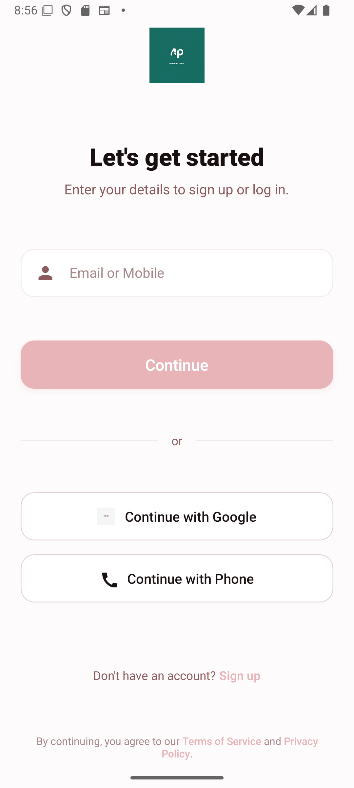

Matrimony App 💑
Welcome to the Matrimony App, a React Native mobile application designed to help users find their perfect match! 📱 This app allows users to browse profiles, like potential matches, apply filters, and manage their own profile with a sleek and modern UI. Built with love and powered by React Native, it’s your go-to platform for meaningful connections. 💖
Overview 🌟
The Matrimony App connects users by letting them swipe through profiles, apply custom filters (age, religion, caste, location), and save their preferences. With a clean interface featuring a #f5f5f5 background, #FF6B6B accents, and white cards, the app ensures a delightful user experience. Key features include gesture-based swiping, persistent storage with AsyncStorage, and a responsive navigation system.
Features ✨

Profile Browsing 🧑‍🤝‍🧑: Swipe right to like or left to reject profiles with smooth animations.
Cross-Gender Filtering ⚖️: View profiles based on user gender (e.g., Male sees Female profiles).
Search & Filters 🔍: Search by name and filter by age, religion, caste, and location.
Likes Management 💕: View and remove liked profiles with swipe-to-remove functionality.
Profile Editing ✏️: Update name, age, gender, religion, caste, location, and bio.
Persistent Storage 💾: Save profiles and preferences using AsyncStorage.
Navigation 🧭: Seamless navigation between Browse, Likes, Messages, and Profile screens.
Error Handling 🛡️: Robust error boundaries to catch and display errors gracefully.

Tech Stack 🛠️

React Native: For cross-platform mobile development.
React Navigation: Stack navigation for smooth screen transitions.
React Native Gesture Handler: For swipe gestures.
AsyncStorage: For local data persistence.
React Native Picker: For dropdown selections.
React Native Modal: For search and filter modals.
React Native Vector Icons: For Material Icons.
TypeScript: For type safety and better developer experience.

Installation ⚙️
Get the app up and running in a few simple steps! 🚀
Prerequisites

Node.js (v16 or higher)
Yarn or npm
React Native CLI
Android Studio or Xcode for emulators

Steps

Clone the Repository:
git clone https://github.com/your-username/matrimony-app.git
cd matrimony-app

Install Dependencies:
npm install
# or
yarn install

Link Native Modules:
npx react-native link react-native-vector-icons

Set Up iOS (if using iOS):
cd ios && pod install && cd ..

Update index.js:Ensure index.js includes:
import 'react-native-gesture-handler';

Run the App:

For Android:npx react-native run-android

For iOS:npx react-native run-ios

Usage 📖

Launch the App 📱:Open the app on your emulator or device.

Set Up Your Profile ✏️:

Navigate to the Profile screen.
Enter your name, age, gender, religion, caste, location, and bio.
Save your profile to enable cross-gender filtering.

Browse Profiles 🧑‍🤝‍🧑:

Swipe right to like or left to reject profiles.
Use the search icon 🔍 to search by name.
Use the filter icon ⚙️ to filter by age, religion, caste, or location.

View Likes 💕:

Go to the Likes screen to see liked profiles.
Swipe right to remove a profile from your likes.

Navigate 🧭:

Use the bottom footer to switch between Browse, Likes, Messages, and Profile.

Screenshots 📸
Below are placeholders for screenshots. To add real screenshots:

Browse Screen

Profile Screen

Likes Screen

Contributing 🤝
We’d love your contributions! 🌟 Follow these steps:

Fork the repository.
Create a feature branch (git checkout -b feature/your-feature).
Commit your changes (git commit -m 'Add your feature').
Push to the branch (git push origin feature/your-feature).
Open a Pull Request.

Please ensure your code follows the project’s style (ESLint/Prettier) and includes tests if applicable.
License 📝
This project is licensed under the MIT License. See the LICENSE file for details.

Built with 💖 by [Your Name]. Happy matching! 🎉
